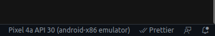
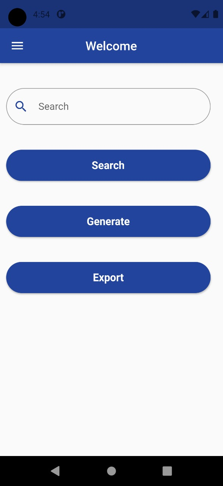
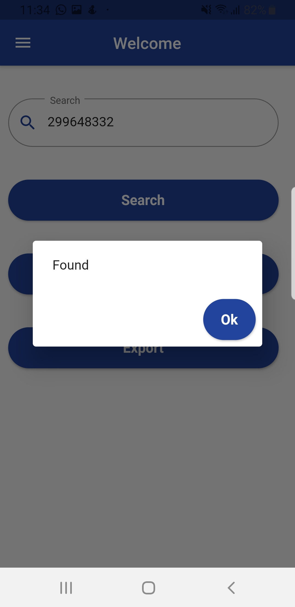
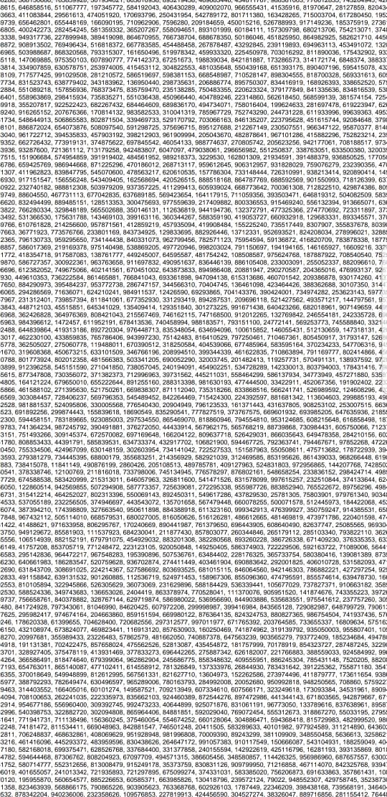

# Randomly

## About The Project

> Randomly is a user-based Mobile application that has the functionality to:
> - Generate 10,000 numbers randomly from a range of [0,1e9].
> - Search for a certain number within those randomly generated numbers using binary search algorithm. 
> - Export those randomly generated numbers into a pdf file.

### Built with

- main project [flutter](https://flutter.dev/)
- SQL Database: [sqlite](https://www.sqlite.org/index.html)
- SQL plugin: [sqflite](https://pub.dev/packages/sqflite)

## Getting Started

> This is an list of needed instructions to set up your project locally, to get a local copy up and running follow these instructions.
### Dependencies
- [Flutter SDK](https://flutter.dev/)
- [Android studio & SDK Tools](https://developer.android.com/studio?gclid=Cj0KCQjwpreJBhDvARIsAF1_BU1WZw30MhADt9uCGO7Uu22s3BwR2ZlU-lTmFigBmLlKTJHcN0MP7dgaAmBxEALw_wcB&gclsrc=aw.ds)

### Installation & Running on vscode

1. **_Clone the repository_**

```sh
git clone git@github.com:GeekMind00/Randomly.git
```

2. **_Navigate to repository directory_**

```sh
$ cd Randomly
```
3. **Make sure your emulator is connected to vscode, it should appear on the bottom right bar**
<div align="center">  

</div>
   
4. **_Run Application_**

```sh
$ flutter run
```

### Screenshots

<div id="img" align="center">  

<br>

<br>

<br>

<br>

<br>

<br>

<br>

<br>

</div>

